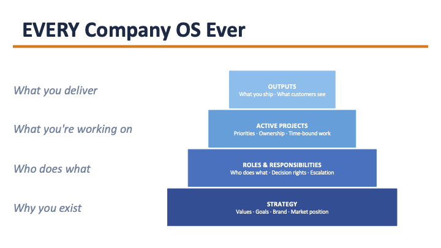
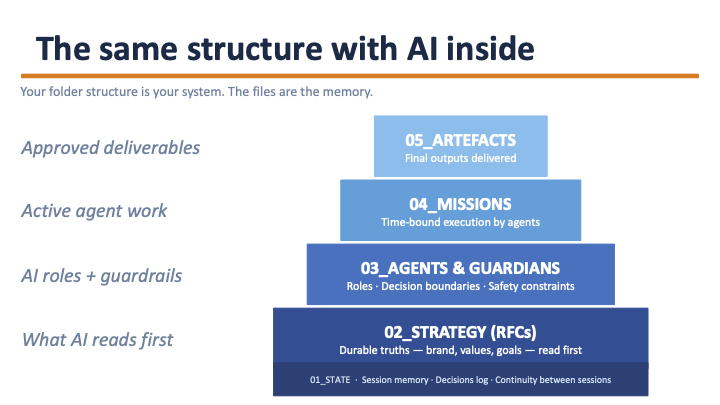

# BoS OS Start

The BoS OS helps you get clear on how your company actually works: how decisions get made, who owns what, and what you're optimising for. It gives AI a governed place inside that system.

Most companies add AI tools on top of an operating system nobody has written down. Strategy lives in the founder's head. Roles blur. Decisions don't stick. AI amplifies whatever's already there. Clarity becomes velocity; muddle becomes noise.

These three skills fix the foundation first, then put it to work.

**Current version: v2.4.0** — [What's new](CHANGELOG.md)

---

## What's here

This repo contains three skills that activate your company BoS OS:

**Bootstrap** models your company OS from public information in under an hour. It produces a first draft of your strategy layer, agent roles, and decision governance, plus a seeded first mission so your agents have a real job from day one. Think of it as the AI doing its homework on your company before you meet.

**Workshop** helps you refine what Bootstrap produced. It works with your insider knowledge, challenging assumptions, sharpening priorities, and turning the skeleton into something that reflects how you actually run the business. As you work through it, the AI starts to understand your strategic goals, identify gaps, and surface opportunities and threats specific to your business.

**Run** is the coordination layer for operating your BoS OS day to day. Three agents (Mission Shaper, Agent Planner, Delivery Manager) take a rough idea and turn it into a staffed, running mission. Use this once Bootstrap and Workshop have done their job.

Use them in sequence. Bootstrap first, Workshop second, Run when you're ready to operate.

> **In plain English:** Bootstrap creates; Workshop refines; Run operates.

---

See the full [CHANGELOG](CHANGELOG.md) for what's new and upgrade instructions.

---

## How it works

Every company already has an operating system. Most just don't know what's in it.

The BoS OS maps that structure, then gives AI a governed place inside it.

Your folder structure is your system. The files are the memory.

---

## Getting started

**Prerequisites:** Claude Pro subscription · Cowork mode enabled

> **New to Cowork?** Start with the [Quickstart](QUICKSTART.md). It gets you to your first session in under 10 minutes.

> **Connect a folder before Step 1.** In Cowork, connect a folder on your computer, somewhere in Dropbox, Google Drive, or similar, before you do anything else. This is where the BoS OS saves everything it creates. If you skip this, files land in Cowork's temporary sandbox and are hard to find later. Step 2 below walks you through it.

**Step 1 — Download the skills**

Go to the [latest release](https://github.com/BoSMark/BoS_OS_Start/releases/latest) and download:
- `agent-os-bootstrap.skill`
- `agent-os-workshop.skill`
- `agent-os-run.skill` *(optional: install after Bootstrap and Workshop are working)*

These are ready-to-upload files. **Do not unzip them.** Upload each file as-is in Step 3.

**Step 2 — Set up your Cowork project**

Before installing the skills, create your project:

1. In Cowork, click **Projects** in the left sidebar
2. Click **New project** (top right)
3. Choose **Start from scratch**
4. Give your project a name (e.g. "My Company OS")
5. Leave Instructions blank — Bootstrap will fill this in automatically
6. Under **Choose project location**, click the folder path and change it to a folder inside Dropbox, Google Drive, or similar. **Don't leave it as the default** (`Documents/Claude/Projects`)
7. Click **Create**

This is not optional. Without a project, nothing saves and you will need to start over.

> **Why change the location?** The default folder isn't cloud-synced. If you leave it there, your files won't be backed up and won't be accessible from another machine.

> **Already have a folder set up?** On the previous screen, choose **Use an existing folder** instead of Start from scratch.

**Step 3 — Install the skills**

In Cowork, click **Customize** in the left sidebar → **Skills** → click the **+** icon (top right of the skills panel) → **Create skill** → **Upload a skill** → select `agent-os-bootstrap.skill`. Repeat for `agent-os-workshop.skill` and, when you're ready to run missions, `agent-os-run.skill`.

> **Don't click "Browse skills" or "Browse plugins"** — those only show pre-built options and won't let you upload your own file.

**Step 4 — Run Bootstrap**

In the left sidebar, click your project name (it will be under **Pinned**). Then type this exactly:

> **Bootstrap my company OS**

It will ask for your company name and build your OS draft from there.

---

## A note on strategy documents

Your BoS OS is built around strategy documents. Each one covers a distinct area of your business: values, growth, product, decision governance, and more. They are living documents, meant to evolve as you learn more about what the system can do. Bootstrap produces a first draft of each from public information. Workshop helps you enrich them with what only you know.

---

## Your first 90 minutes after Bootstrap

Bootstrap produces a lot. Don't try to process it all at once. Check your `BOOTSTRAP_SUMMARY.md` first, it tells you exactly what to do next. Then:

1. Read your CLAUDE.md and correct anything that's wrong, paying particular attention to tone and terminology
2. Read your Values strategy document and adjust it to sound like you, not like a consultant wrote it
3. Pick one strategy document that covers your biggest current challenge and spend 20 minutes with Workshop on that alone
4. Ignore everything else for now. The rest will still be there

The system is designed to be lived in gradually, not consumed in one sitting.

If Bootstrap gave you something useful in the last 90 minutes, a star on this repo helps the next founder find it too.

---

## Upgrading from an earlier version

If you installed the toolkit at a Business of Software conference or from an earlier release, v2.2 is a significant upgrade. Your existing files are safe, the migration is additive.

See [CHANGELOG.md](CHANGELOG.md) for the upgrade steps.

---

## Troubleshooting

**Plugin validation failed**

Check the following in order:
1. Did you download the `.skill` file from the releases page? If you downloaded a zip of the whole repo, that won't work. You need the individual `.skill` file.
2. Did you unzip it? Don't. Upload the `.skill` file directly as downloaded.
3. Are you uploading via **Upload a skill** (not Browse skills or Browse plugins)? Browse only shows pre-built options.

**Nothing happened after I typed "Bootstrap my company OS"**

The skill didn't install correctly, or you're not inside your project. Check: (a) you uploaded via **Customize → Skills → + → Create skill → Upload a skill**, and (b) you clicked your project name in the left sidebar before typing.

**Files aren't saving / I can't find what Bootstrap created**

You're not inside a Cowork project, or your project isn't linked to a folder. Go to Projects, check your project exists, and confirm it shows a folder path. If not, create a new project and run Bootstrap again.

**The UI looks different from the instructions**

Claude's UI labels vary slightly across accounts and versions. If you can't find "Upload a skill", look for: *Add skill*, *Upload plugin*, or *Personal plugins → Create plugin*. You're always looking for a way to upload a file, not browse a catalogue.

---

## Want just one skill?

- Bootstrap only → [BoSOS-Bootstrap](https://github.com/BoSMark/BoSOS-Bootstrap)
- Workshop only → [BoSOS-Workshop](https://github.com/BoSMark/BoSOS-Workshop)
- Run layer → included in this repo under `agent-os-run/`

---

## Ready to go further?

Once Bootstrap, Workshop, and (if you're running missions) Run are working, the next stop is **[BoS OS: Advancing Skills](https://github.com/BoSMark/BoS_OS_Advancing_Skills)**: standalone skills for a BoS OS that's already running, released independently as they ship. Current line-up: SignalProcessing (turns transcripts into signals for your core documents) and Prospect Intelligence Scoping (pressure-tests a prospect-intelligence system before you build it).

Further skills, scheduled tasks, and agent specs are also released on an ongoing basis in this repo and others.

All BoSMark repos → [github.com/BoSMark](https://github.com/BoSMark)

**Questions, ideas, or feedback?** → [BoS OS Discussions](https://github.com/BoSMark/BoS_OS_Start/discussions)

---

## Stay in the loop

Workshops, user groups, and community support:

**[businessofsoftware.org/updates](https://www.businessofsoftware.org/updates)**

Subscribe for workshop announcements, guided cohorts, and peer community access.

---

*Built by Tim Barker, Mark Littlewood and [Business of Software](https://businessofsoftware.org), helping software founders build profitable, enduring companies since 2007.*
